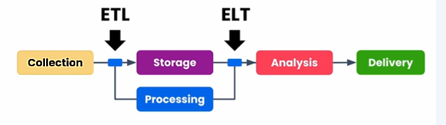
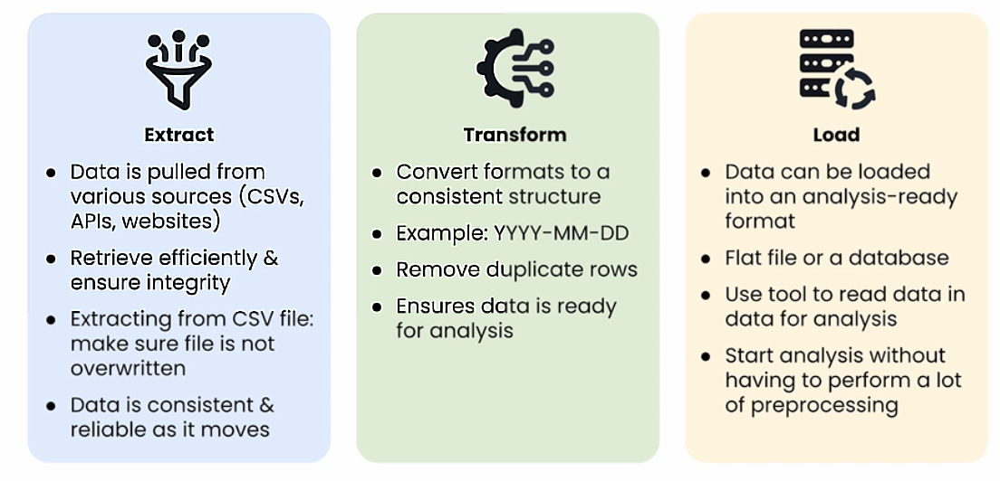
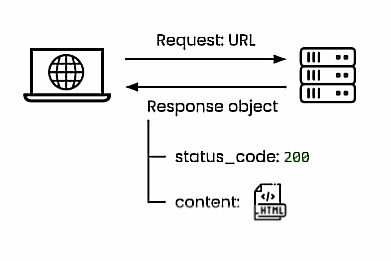

# Web Scraping and Text Preprocessing

## Data Sources

**Scenario**: Working on Analysis

* **Load Jupyter notebook**: The interactive environment used for writing code.

* **Load data into DataFrame**: The primary structure (like a table) used for data manipulation in Python.

* **Use .csv file to read in data**: A common method for importing external data.

**Practical Data Sources**

In a professional environment, you will interact with a variety of sources:

* **Flat files**: Simple files like .csv or .txt.

* **Databases**: Structured storage systems like SQL.

* **APIs**: Interfaces used to "talk" to other software or web services.

* **Web scraping**: Extracting data directly from websites.

**What is a DataFrame?**

Think of a DataFrame as a digital spreadsheet. In Python (specifically using the pandas library), it is a two-dimensional structure where data is aligned in rows and columns. It is the "workhorse" of data science because it allows you to filter, sort, and calculate data very quickly.

**Flat Files vs. Databases**
Flat File (.csv): These are "flat" because they contain no structural relationships between records (other than being in the same list). They are easy to share but difficult to manage when the data becomes massive.

Database: These are designed for scale. They allow multiple users to access data simultaneously and can link different tables together (e.g., linking a "Customers" table to an "Orders" table).

**APIs vs. Web Scraping**
API (Application Programming Interface): The "clean" way to get data. A website (like Twitter or Weather.com) provides a specific "doorway" for your code to request data in a structured format.

Web Scraping: The "manual" way to get data. If a website doesn't have an API, you use code to read the HTML of a webpage and "scrape" the information you need. It is often more fragile because if the website changes its design, your scraper might break.

| Category |	Example | 	Primary Data Source |
| :--- | :--- | :--- |
| Generated |	Sales records |	Database |
| Collected |	Competitor prices, weather |	Web scraping, APIs |
| Historical |	Investment transactions |	Flat file (e.g., .csv) |

Generated data is usually internal (your company’s own sales).

Collected data is usually external (what the rest of the world is doing).

Historical data is used to find trends over time, often stored in "cold storage" (flat files) because it isn't updated frequently.

---

## Proprocessing

**1. Start with Raw Data**

Raw data is unprocessed information in its original form. This is data exactly as it was collected from a source (like a sensor, a database, or a web scraper) before any cleaning or filtering has occurred. It is often "noisy," containing errors or irrelevant information.

**2. Make Data Suitable for Analysis**
To transform raw data into a usable state, several key tasks are performed:

| Task | Purpose |
|:--- | :--- |
| Removing duplicates |	Ensures each observation is unique so that redundant data doesn't bias the results.|
| Handling missing values |	Deciding whether to delete rows with missing data or fill them in (imputation) with averages or logical guesses. |
| Handling outliers |	Identifying and addressing data points that are significantly different from the rest, which could be errors or important anomalies.|
| Fixing inconsistent formatting |	Standardizing data, such as ensuring all dates are in the same format (e.g., MM/DD/YY) or that "NY" and "New York" are treated as the same value.|
| Selecting a subset of features	| Reducing the number of variables by keeping only those most relevant to the analysis (also known as Feature Selection). |
| Scaling values |	Adjusting numeric data to a common range (like 0 to 1) so that variables with large numbers don't unfairly dominate the model. |
| Encoding categorical variables | Converting text-based data (like "Red" or "Blue") into numbers so a computer can process the information mathematically. |

**Data preprocessing benefits**

* **Accuracy**: Cleaning data removes errors that would otherwise lead to wrong conclusions.

* **Efficiency**: Reducing features and scaling values helps models run faster and use less computing power.

* **Consistency**: Standardizing formats allows you to combine data from different sources into one cohesive dataset.

---

## Pre-processing for business problems

**Goal #1: Identify testimonials for a website**

To find the best customer quotes, the data is preprocessed by:

* **Filtering by language**: Ensuring the testimonials are in a specific language (e.g., English).

* **Removing PII**: Stripping away Personally Identifying Information (like full names or IDs) for privacy.

* **Sentiment Analysis**: Selecting only messages that express "positive sentiment," filtering out negative reviews like "Not helpful".

**Goal #2: Rank hashtags to promote products online**

To understand social media trends, the data is preprocessed by:

* **Removing media**: Deleting all images and videos to focus strictly on text.

* **Extraction**: Pulling only the hashtags (e.g., #DogToys) from the posts.

* **Frequency count**: Creating a ranked list of the top 5 unique hashtags based on how often they appear.

---

## Data Preprocessing vs. Data Cleaning

Data preprocessing is the broad umbrella of steps used to prepare raw data for analysis. Data cleaning is considered a subset of that larger process.

| Data Preprocessing |	Data Cleaning |
|:---| :--- |
| Goal: Prepare raw data for analysis. |	Goal: Fix specific problems within the data. |
| Includes: Filtering, transforming, and organizing. |	Includes: Correcting errors and fixing typos.|
| Includes: Aligning data with analysis goals.	| Includes: Fixing inconsistencies. |
| Includes: The entire data cleaning process.	| Includes: Removing duplicates. |

---

## validating the data

In this step you will make sure if the data matches the expectations and if the preprocessing did not introduce any new problems.

this includes for example,
* Are all products name standardized?
* Have all the missing values been addressed?
* Does the number of sales make sense across all locations?

---

## ETL vs ELT

Data can be processed at different stages of the pipeline: before storage or after.


| Feature	| ETL (Extract, Transform, Load) |	ELT (Extract, Load, Transform) |
| :--- | :--- | :--- |
| Transform Stage |	Happens during Preprocessing before storage. |	Happens during Analysis after storage. |
| Data State |	Saved into analysis-ready formats. |	Data is left "as is" or reserved for later. |
| Best For |	General preprocessing that everyone needs. |	Exploration in Python notebooks for specific analysis. |

### What is ETL



### what is ELT


---

## Web Scraping

Its a process of collecting the data from websites, its useful where no other data source can provide the information that you need.

**Example: Competitor prices for online pet store**

* **Scattered Information**: Competitor data is often spread across many different websites.

* **Accessibility Issues**: There is usually no simple "download" button or easy way to obtain this data directly.

* **Lack of Structure**: Because a "neat" flat file of this data is not readily available, it must be manually or programmatically gathered.

* **Inherent Difficulty**: Without automation, collecting this information is extremely time-consuming and highly prone to errors.

idea here is, using the code to go to different websites and collecte the data you need.

**How Web Scraping works**

* Transforms information designed for huamn viewing into data for analysis.
* Websites are often formatted to provide visually appealing experience.

This involves:
* Gathering document of unstructured text and code that makes up websites
* Use different code techniques to extract only data in structured format like rows and columns

**Web Scraping challenges**
* Not all websites are well organized making it harder for scraper to locate the data. 
    example: pet supply product prices.
    *   Sale price might be located in a different part of the page
    *   Missing values for any product that's discounted.
* Dynamic content poses problems
    *   Might update layout or content
    *   Web scrapers need maintance to keep up with the changes

However if the structure stays consistent while content is dynamic, web scrapers truly shine. Example: Product pages. one scraper can find the price of every product on the website.

---

## Missing data

It is the value that are absent from a dataset where they're expected.

this may be due to:
* Human error
* Incomplete data collection
* Technical issues

Impact depends on the nature and extent of the missing data.

* **large proportion is missing**: 

    * Example: Only 5% report income
    * Impact: Might not have enough data to generalize for entire city

* **Missing in a systematic way**: 

    * Example: High income individuals less forthcoming about the income.
    * Impact: Bias analysis to conclude average income lower that it is.

#### Handling the missing data

1. **Remove (dropping) rows or columns**:

    * ***Consider dropping rows if small fraction is missing***. for example: 1% of residents did not share their age. but dropping too many rows can reduce the representativeness of the dataset.

    * ***Consider dropping columns if large fraction is missing***. for example if 95% missing incomes remove feature from analysis.

    we can use dropna() method:
    
        example: ` df.dropna(subset = ["Dog Population"])`

    this ensures calculations are based on the non missing data.
    **subset** to drop rows with missing values in any of those columns.

2. **Fill in missing values**: 

    * ***If assumptions make sense*** for example: "Employment status": full time. weekly hours: 40, invalid approach would be filling values with 0

3. **Fill with descriptive statistics**: like mean or mode or use regression or machine learning to fill in the best value. 
     
     example: df["Dog population"].fillna()

---

## String method contains()

Helps to find specific text or features.

let's take scenario where we need to identify countries where you can most easily deploy aid workers

* largest pool of aid workers speak English or German.

* **Task**: Filter countries where English or German is in "Official Language** column.

    example: 
    `df["Official Language"].str.contains("German", case = False)`

    * This is a great tool for creating columns based on text data.

    * identify rows that contain specific strings.

    * Argument is often called a **substring** a part of the string you're looking for. it does not have to make up for the entire string though it can.

    * **str.contains()** is case sensitive, set, **case = False** to find all instances.

---

## string method strip and split.

* use .**split()** to break a string into a list of substrings.

for example, `df['Country'] = df['Country].str.split('[').str[0].str.strip()`

* use open bracket character to split a string into 2 parts 

* selected the frist string from that list.

* Use **.str.strip()** to strip leading and trailing any whitespace, will remove whitespace, tabs and newline characters.

---
## Networking

---

## Requests



use requests module to retrieve webpage content using,

import requests 

url = "use the url as a string"
reponse = requests.get(url)

to see whether the request worked use,

response.status_code

give you raw HTMl of the webpage,

response.content

---

## HTML - Hyper Text Markup Language

its text enhanced with tags that provide additional information.

tags typically open and close wrapping around some content.

example for html element:

 <h1> Astronomy calendar of celestial events for calendar year 2030 </h1>
hear **<h1></h1> tags** mean Level 1 heading.
text in between is called content.

headings vary from h1 to h6 of different length
<p> for paragraph <a> for anchoring etc.

self closing tags -  used for images

### Html attributes

tags can have attributes, can include additional info: size, color, position, source. Inside angle brackets of opening tag.

example: 
```html
<a href = "http://www.usno.navy.mil/USNO">U>S> Naval Obeservatory</a>
```

href - refers to hypertext reference where the link takes you. in the above example the link refers to US naval observatory from the webpage.

another example:
```html

```

* src("source") -> URL or file path of the image
* alt("alternative text")->shows up if fails to load
* width and height-> tells how large the display should be.

### Web Scraping and Data Assembly

* **To get specific HTML elements:**
    ```python
    # Finds <li> elements that have any class attribute
    elements = soup.find_all("li", class_=True) 
    ```

* **Loop to process each event:**
    ```python
    for event in soup.find_all("li", class_=True):
        # Processing logic here...
    ```

* **To locate the first occurrence of an element with a specific class:**
    ```python
    # Note the underscore in class_
    date_element = event.find("span", class_="date-text")
    ```

* **To extract inner text safely:**
    ```python
    # Using .get_text(strip=True) is safer as it removes extra whitespace
    date = event.find("span", class_=True).get_text(strip=True)
    ```

* **Assembling and appending to a list:**
    ```python
    event_list.append([date, title, description])
    ```

* **Constructing the DataFrame from the list:**
    ```python
    # Note the capital 'D' and 'F' in DataFrame
    df = pd.DataFrame(event_list, columns=["Date", "Title", "Description"])
    ```

---

## Data frame setup

* **To assign column names:**
    ```python
    df.columns = ["Date", "Title", "Description"]
    ```

* **To clean string values in the DataFrame:**
    ```python
    # Remove periods from Titles
    df["Title"] = df["Title"].str.replace(".", "", regex=False)
    
    # Extract the day/month part before the comma
    df["Date"] = df["Date"].str.split(",").str[0]

    # Extract everything after the first period in the Description
    # n=1 ensures we only split once
    df["Description"] = df["Description"].str.split(".", n=1).str[1]
    ```

* **Use helper function to cast date from string to datetime:**
    ```python
    def convert_date_time_column(df, year):
        # Concatenate the year and convert to datetime objects
        df["Date"] = pd.to_datetime(df["Date"] + f' {year}', format='%B %d %Y', errors='coerce')
        return df

    df = convert_date_time_column(df, 2030)
    ```
---

## Regular expressions

